# Joint PPH + Cardiac Arrest — Clinical logic flowcharts

**Purpose:** Clinical review of what the app *prompts*, *times*, and *gates* — not UI wiring.  
**Branch:** `emergency` (Option A joint deck + embedded arrest)  
**Sources:** `EmergencyPage.jsx`, `cardiac-arrest-shared.js`, `pph-logic.js`, `pph-shared.js`

---

## How to use this document

1. Start with the **[overview diagram](#overview--pph-with-cardiac-arrest-branch)** — PPH trunk + arrest branch in one view.
2. Then **§1 Session lifecycle** and **§2 What shows in NOW** — when arrest beats PPH in the NOW card.
3. Review **§3 Arrest algorithm** and **§4 PPH priority ladder** in parallel — the two clinical engines in detail.
4. Use **§5–§8** for timing gates (blood, uterotonics, TXA, carbo).
5. Walk **§10 Scenario paths** with a paper case — each path is a checklist for your review.
6. Note **§11 Known simplifications / review questions** — items to confirm against GTG52 / GTG56.

> **Overview:** See the [single diagram below](#overview--pph-with-cardiac-arrest-branch) for the full session arc. The sections that follow zoom in on each engine — same logic, multiple levels of detail.

---

## Overview — PPH with cardiac arrest branch

Single diagram aligned with **`EmergencyPage.jsx`** (`computeNextPrompt`, `buildJointNowPrompt`). PPH is **not** a linear S1→S2→S3 path — the app evaluates a **priority ladder** every tick and shows **one NOW prompt**.

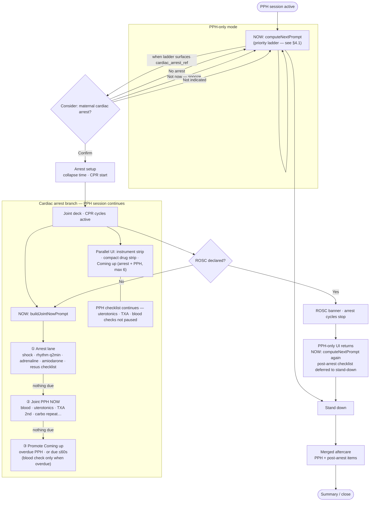

**How the ladder reaches the arrest consider prompt (three entry paths):**

| Path | When | Priority |
|------|------|----------|
| **ABC instability** | User taps *Check for cardiac arrest* on ABC task | Forces `cardiac_arrest_ref` → **1.04** |
| **Forced ref** | `cardiac_arrest_ref` already in forced queue | **1.04** (any PPH level; blocked once joint arrest active) |
| **Massive backup** | Massive PPH + ABC done; ref not yet offered | **7.6** (automatic consider if ABC button not used) |

**Reading the branch:**
- **PPH-only:** one NOW card from the full priority ladder (§4.1). No sequential “phases” — stabilisation, uterotonics, blood checks, and TXA compete by priority.
- **Joint deck:** UI switches to Option A deck. **Arrest always wins NOW** when shock/rhythm/adrenaline/amiodarone/checklist items are due; otherwise joint PPH NOW; otherwise promote Coming up.
- **Parallel lane** is not a second algorithm — it is the **same PPH tasks** shown in drug strip, Coming up, and checklist while arrest runs.
- **ROSC** stops CPR-cycle prompts and restores the **PPH-only prompt rail**. Full post-arrest panel waits until **stand-down** (§9).
- **Stand down** is available from the header at any time (PPH-only, during joint arrest, or after ROSC).

---

## §1 Session lifecycle

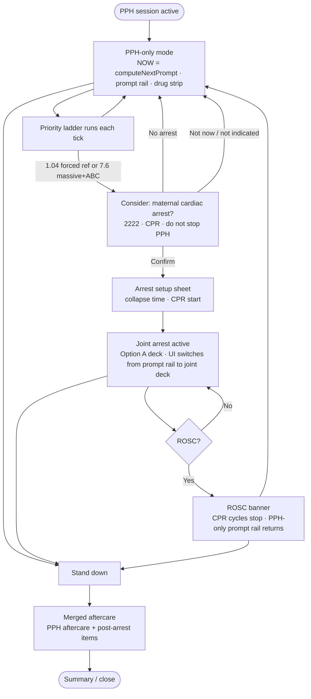

**Arrest consider — three ways onto the prompt:**
1. **ABC instability button** (on ABC task) → forces `cardiac_arrest_ref` at **any** PPH level → priority **1.04**
2. **Already forced** → priority **1.04** (skipped once `jointArrest.active`)
3. **Massive + ABC done** → automatic consider at priority **7.6** if not already forced

**Clinical note:** During joint arrest, PPH haemorrhage management is explicitly *not* paused (`pph_continue` resus item). Confirming arrest pre-fills airway/IV on the arrest checklist if ABC/IV already done in PPH.

---

## §2 What shows in NOW (master router)

The **NOW card** shows one prompt at a time. Priority is fixed:

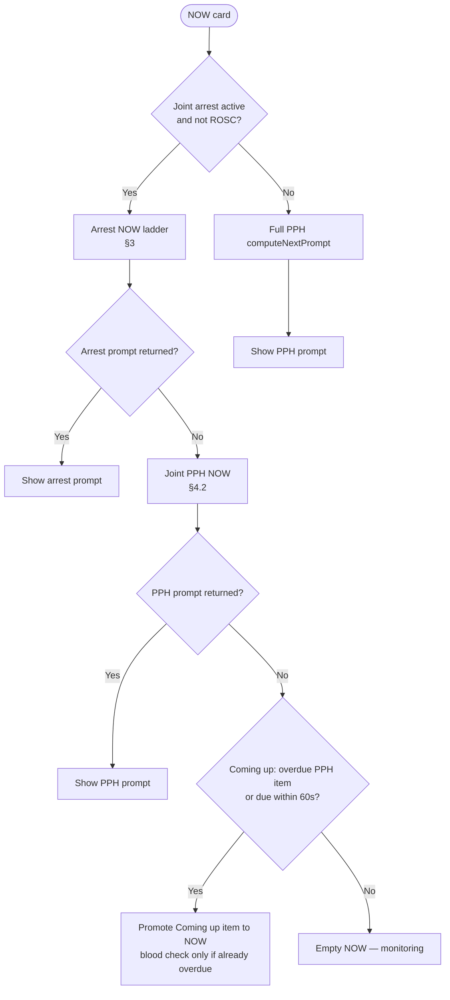

**Arrest always wins** over PPH when both are due.

**Parallel UI (not in NOW):**
- **Instrument strip** — PPH elapsed, blood loss, rhythm countdown, adrenaline, blood-check due
- **Compact PPH drug strip** — TXA 2nd, carboprost repeat, next uterotonic countdown
- **Coming up** — merged arrest + PPH timeline (max 6 items, overdue first)

---

## §3 Arrest algorithm (joint / postpartum)

### 3.1 NOW priority ladder

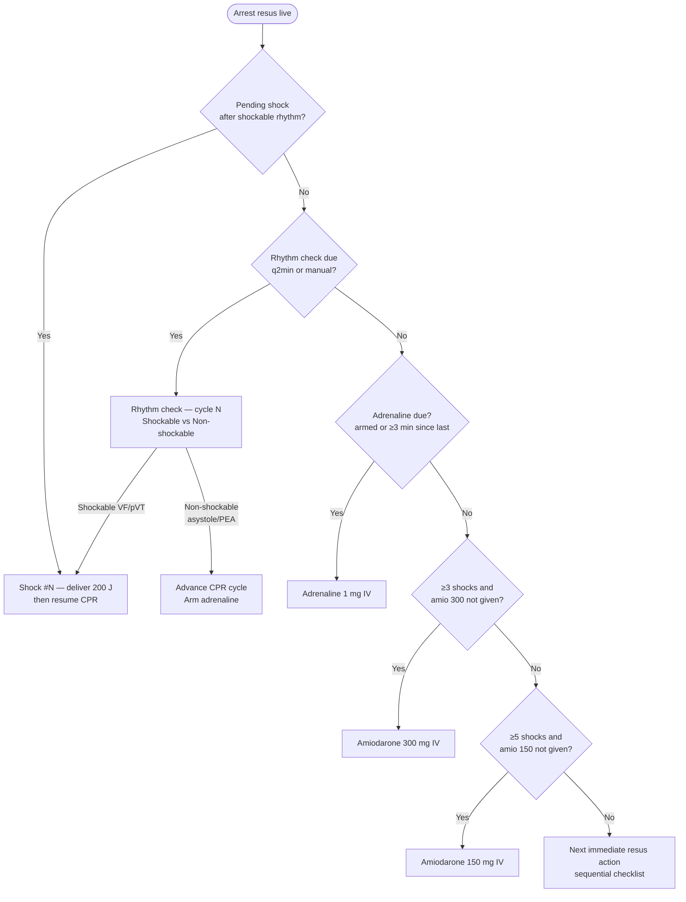

### 3.2 Rhythm → shock → drugs (decision detail)

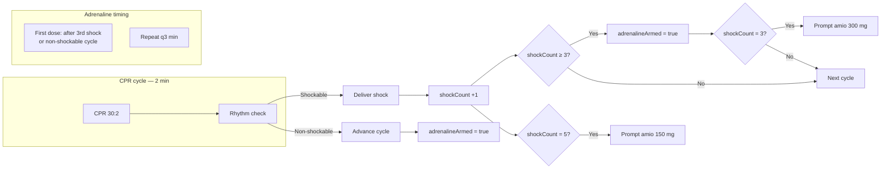

### 3.3 Immediate resus checklist (joint — postpartum)

Order in **Coming up** after timed items; first pending item can appear in NOW:

| # | Action | Syncs to PPH |
|---|--------|----------------|
| 1 | 2222 — maternal cardiac arrest | *(auto-done at start)* |
| 2 | CPR 30:2 | — |
| 3 | Airway — high-flow O₂ | **→ ABC done** |
| 4 | IV access above diaphragm | **→ IV access done** |
| 5 | Defibrillator — rhythm q2min | — |
| 6 | Continue haemorrhage control | *(PPH deck below)* |

**Prefill at arrest start:** If PPH **ABC** already done → airway ticked. If **IV access** done → IV ticked.

**Bidirectional sync during joint arrest:**
- Tick arrest **airway** → PPH **abc** marked done  
- Tick arrest **IV** → PPH **iv_access** marked done  
- Complete PPH **abc** / **iv_access** → matching arrest items ticked  

---

## §4 PPH priority ladder

### 4.1 Full ladder (PPH-only mode)

Evaluated top-to-bottom in **`EmergencyPage.jsx` `computeNextPrompt`**; first match wins. *(Differs from `pph-logic.js` test copy — this order is what the app runs.)*

```mermaid
flowchart TD
  P0([computeNextPrompt]) --> P104[1.04 Forced cardiac_arrest_ref<br/>any level · blocked if joint arrest active]
  P104 -->|No| P105[1.05 User tapped assigned follow-up row]
  P105 -->|No| P155[1.55 Theatre preparing — confirm transfer]
  P155 -->|No| P106[1.06 Queued uterotonic user selected]
  P106 -->|No| P108[1.08 Blood loss check overdue]
  P108 -->|No| P11[1.1 Critical follow-ups overdue<br/>calls · IV at major+ · TXA assign chase]
  P11 -->|No| P15[1.5 Tone check after fundal massage<br/>deferred at massive until MHP/TXA/2nd cannula]
  P15 -->|No| P175[1.75 Forced tasks queue<br/>theatre · txa · trauma treatment · CI fallbacks…]
  P175 -->|No| P112[1.12 IV fail window expired → IM route offer]
  P112 -->|No| P22[2.2 Uterotonic escalation — Still bleeding?]
  P22 -->|No| P4[4.0 Non-critical follow-ups overdue]
  P4 -->|No| P49[4.9 Stabilisation trio<br/>call · ABC · IV — fixed order]
  P49 -->|No| P5[5.0 Critical unstarted tasks<br/>massive: MHP → TXA → 2nd cannula]
  P5 -->|No| P58[5.8 IV done → oxy infusion reassess?]
  P58 -->|No| P6[6.0 Carboprost repeat due — rate-scaled]
  P6 -->|No| P65[6.5 TXA 2nd dose due · ≥30 min · within 3 h birth]
  P65 -->|No| P7[7.0 Next regular task<br/>uterotonic timing gates apply]
  P7 -->|No| P75[7.5 Massive consider tasks<br/>bakri · theatre — not arrest]
  P75 -->|No| P76[7.6 Massive + ABC done → consider arrest<br/>backup if ABC button not used]
  P76 -->|No| MON[Monitoring — nothing due]
```

### 4.2 Joint mode — PPH NOW (`computeJointPphNowPrompt`)

Same engine **except**:
- Uses **synced task states** (arrest airway/IV cover PPH abc/IV)
- **Blocks** during live arrest:
  - `cardiac_arrest_ref` task
  - Massive **consider arrest** prompt
  - *(Rhythm/shock handled only in arrest lane)*

If `computeNextPrompt` returns monitoring or blocked prompt, joint PPH NOW falls through to:

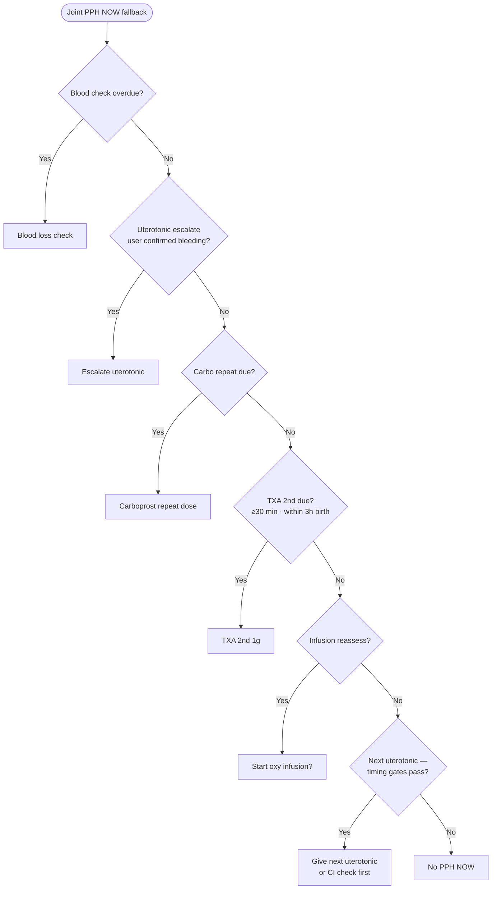

---

## §5 Blood loss reassessment

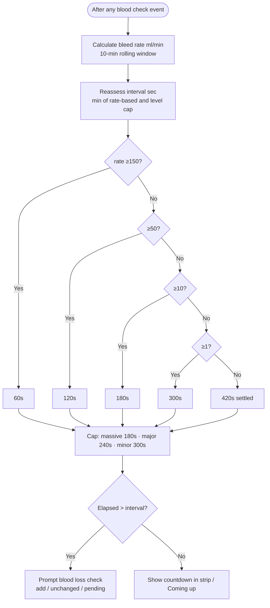

**Level thresholds:** Minor &lt;1000 ml · Major ≥1000 · Massive ≥2000 ml

---

## §6 Uterotonic ladder

### 6.1 Ladder order

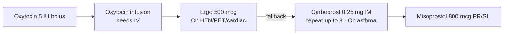

### 6.2 Escalation gates (after first uterotonic)

All must pass before **next** uterotonic is offered:

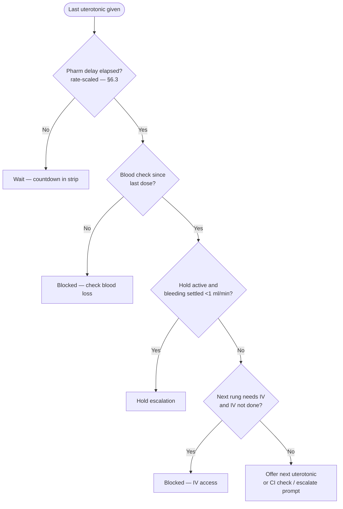

**Escalation prompt:** After gates pass, user may see *“Still bleeding?”* → Yes queues next / Hold if settled.

### 6.3 Rate-scaled pharm delays (seconds)

Base delay × bleed rate tier (floor 60s for uterotonics; carbo repeat floor 5 min):

| Uterotonic | Base delay | &lt;1 ml/min | 1–10 | 10–50 | ≥50 ml/min |
|------------|------------|------------|------|-------|------------|
| Oxy bolus | 180s | 100% | 75% | 50% | **60s floor** |
| Oxy infusion | 300s | 100% | 75% | 50% | 60s |
| Ergometrine | 300s | 100% | 75% | 50% | 60s |
| Carboprost (ladder step) | 900s | 100% | 75% | 50% | 60s |
| Misoprostol | 600s | 100% | 75% | 50% | 60s |

**Carboprost repeat:** Base 15 min between doses → same scaling (floor 5 min).

---

## §7 TXA logic

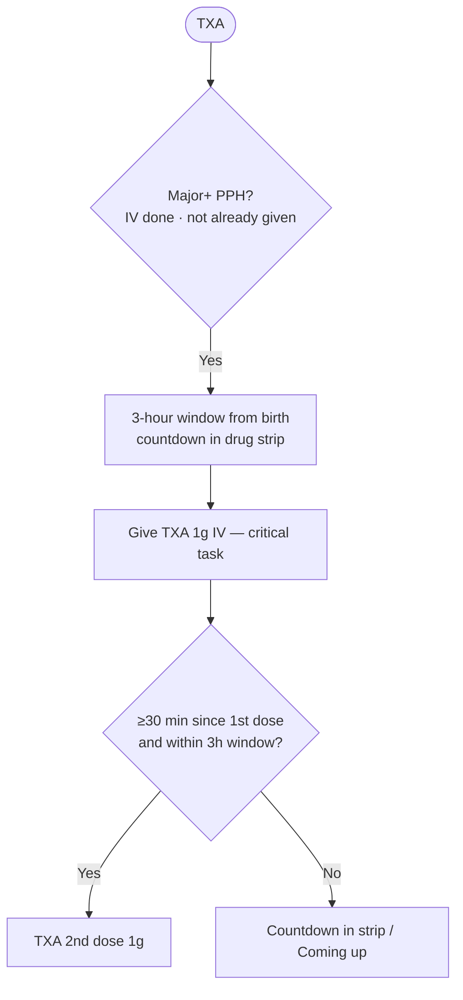

---

## §8 Task prompt types (clinical branches)

When a task is reached, it may surface as:

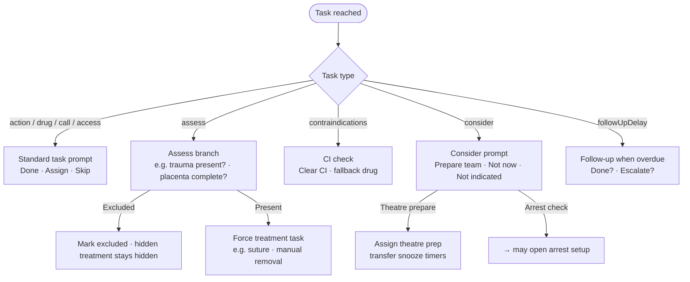

**Tone gate:** After fundal massage → **tone check** before bimanual / trauma / tissue assess.

**Trauma follow-up:** Suture assigned → 5 min *“bleeding controlled?”* → escalate theatre if not.

---

## §9 ROSC and stand-down

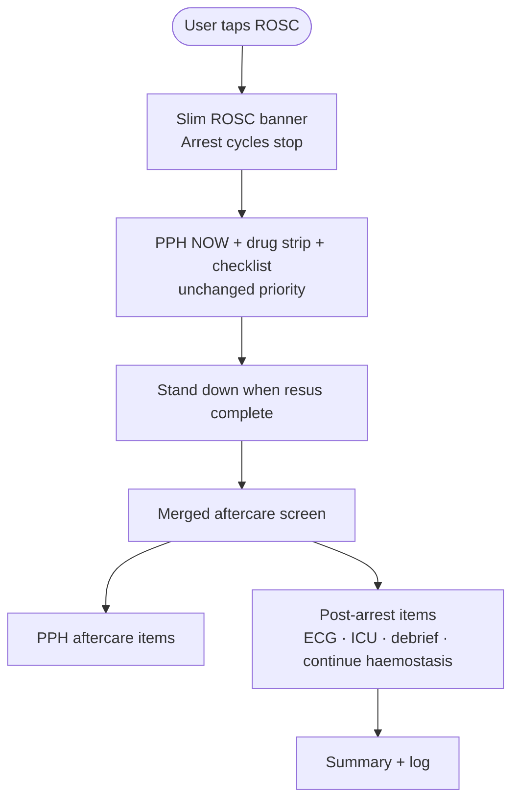

**Review point:** Full post-arrest checklist is deferred to **stand-down**, not shown during active PPH after ROSC.

---

## §10 Scenario paths (clinical walk-through)

Use these as structured review cases. Tick each decision the app should surface.

### Scenario A — Major PPH → arrest on ward
1. Start ≥1000 ml → level **major** → call major · ABC · IV · TXA window  
2. Give oxy bolus → fundal → tone → assess trauma/tissue  
3. Bleed rate brisk → blood checks q1–3 min  
4. ABC + IV done → user confirms arrest → **joint deck**  
5. **NOW:** rhythm q2min beats TXA assign chase  
6. Shockable ×3 → adrenaline armed → amio 300  
7. PPH **compact strip:** carbo countdown · TXA 2nd · next ergo  
8. Complete **airway** on arrest list → PPH **abc** auto-done  
9. ROSC → banner only → continue carboprost / TXA / blood products  
10. Stand down → post-arrest + PPH aftercare  

### Scenario B — Uterotonic escalation during arrest
1. Last dose oxy infusion → pharm wait (rate-scaled)  
2. Blood check logged → gates open → *Still bleeding?* → Yes  
3. Ergo CI (PET) → fallback **carboprost** or CI cleared  
4. Arrest rhythm due **overrides** ergo in NOW; ergo stays in Coming up  
5. Carbo dose 1 → repeat timer (rate-scaled 15 min base)  

### Scenario C — IV fails at massive PPH
1. IV assigned → deadline by level (90s massive)  
2. Window expires → **IV fail** prompt → IM ergo / carbo / miso options  
3. If arrest starts with IV still pending → separate arrest IV action  

### Scenario D — Massive consider theatre
1. ≥1500 ml + ladder exhausted + rate ≥10 ml/min → **theatre** forced consider  
2. Prepare team · snooze · in-theatre confirmation follow-ups  
3. Blocked during arrest if task is arrest-check type only  

### Scenario E — Settled bleeding hold
1. Rate &lt;1 ml/min after last uterotonic + blood check  
2. User taps **Hold** on escalation → uterotonicHold  
3. Next rung suppressed until bleeding recurs (hold clears on new blood event)  

---

## §11 Clinical review checklist

Questions to answer as you walk the diagrams:

| # | Topic | Review question |
|---|--------|-----------------|
| 1 | Arrest priority | Is shock → rhythm → adr → amio → checklist the right clinical order for postpartum? |
| 2 | PPH during CPR | Is “continue haemorrhage control” sufficient prompt density vs TXA/carbo/uterotonics? |
| 3 | Sync | Should **fundal massage** / **bimanual** sync to any arrest action? (Currently **no**) |
| 4 | Adrenaline | First dose only after 3rd shock or non-shockable cycle — correct for joint? |
| 5 | Amio | 300 mg at shock 3, 150 mg at shock 5 — align with local ALS? |
| 6 | Blood interval | Rate table + level caps — too aggressive or too slow? |
| 7 | Uterotonic delays | Rate scaling at ≥50 ml/min → 60s floor — clinically safe? |
| 8 | Carbo repeat | 15 min base scaled to 5 min floor — matches GTG52? |
| 9 | TXA 2nd | 30 min + 3 h window — correct? |
| 10 | ROSC | Defer full post-arrest panel until stand-down — acceptable on ward? |
| 11 | Theatre force | 1500 ml + exhausted ladder + rate ≥10 — right triggers? |
| 12 | IV fail | IM options only ergo/carbo/miso — missing oxy IM? |

---

## §12 File map (for developers — optional)

| Logic | File |
|-------|------|
| Joint NOW / Coming up | `EmergencyPage.jsx` |
| Arrest timing + checklist | `cardiac-arrest-shared.js` |
| PPH priorities | `pph-logic.js` + `EmergencyPage.jsx` (duplicate TASKS) |
| Level thresholds + rate scaling | `pph-shared.js` |
| UI deck | `JointResusDeck.jsx`, `SosDrugStrip.jsx` |

---

*Generated for clinical review. Update this doc when algorithm changes are agreed.*
